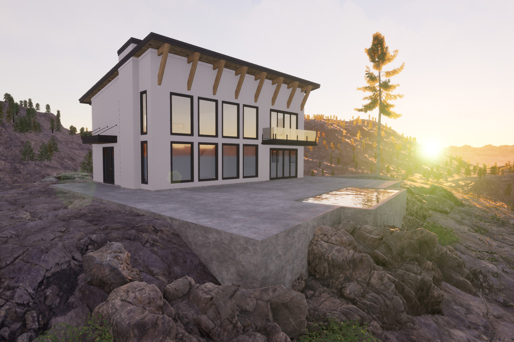

Design is an evolutionary process and clients needs and tastes sometimes change throughout the process. This project perched high above Kelowna over looking the city was originally designed as a simplistic prairie farmhouse and Scandanavian modern hybrid, but it was decided that option didn't fully take advantage of what the project site had to offer. This latest version is the byproduct of working with the client and builder, satisfying both wants and budget.

Comitting fully to a more a modern design and leaving the farmhouse behind, this new version takes full advantage of the lake view with a two storey window wall in the main living area with a second floor loft also taking advantage of the view. Simple exterior finishes keep the budget in check with some timber detailing and second floor balcony to break up the massing. 

While this is a step in a right direction and the drawings are ready for permit, there's been realization that some of the best views aren't the most obvious. With Okanagan Mountain Park and mountains surrounding the property a new design is potentially on the table to capture the Okanagan's beauty in every direction. 

Back to the drawing board!