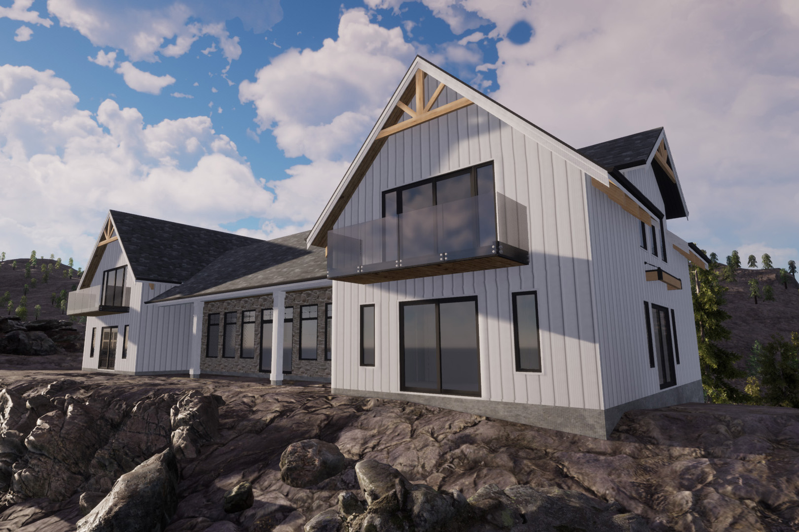

Design is an evolutionary process and clients needs and tastes sometimes change throughout the process. After many interations and the constant battle between wishes and the realities of budgets, the client is content with a simplistic take on a modern farmhouse. 

This latest version takes full advantage of the panoramic views. Both sides of the expansive main hall are lined with windows to, giving a sense of the rugged setting from the comfort of the main living area and kitchen. Large sliding doors in nearly every room continue the spectacular views and ensure that nature is never more than a few steps away.   

Symmetry was emphasized throughout the design when possible to make the most visual impact of an otherwise simple form. Small wood elements and a touch of stone add some luxury while the majority of cladding is cement fiber board and batten to keep the budget in check.

With all the blasting and extensive site works already complete, we're eager to see this one get out of the ground before the snow piles up!