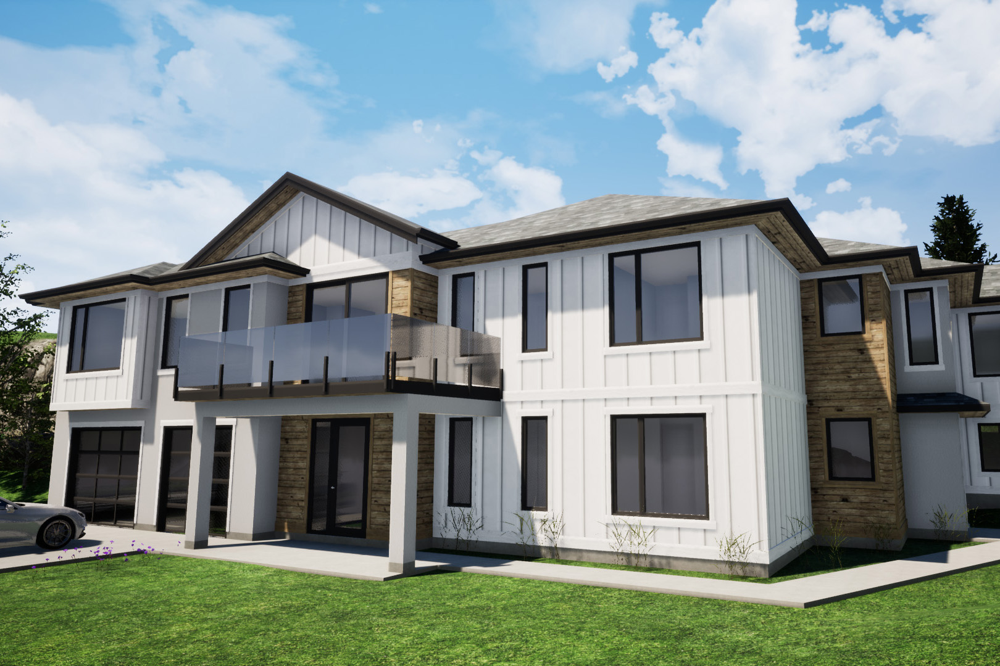

As a multi-generational family home on a tricky odd shaped walk-up lot, the Gill residence posed some challenges. Clever orientation of the home against the slope at the back of the yard instead of the street helped maximize the useable area of the site and also preserved a slice of lake view between downhill neighbours.

Intended to be home for three generations the house comes complete with **eight** bedrooms! Two are located in a seperate suite on the lower level, two additional guest rooms on the lower level, three upstairs for the kids, and a master suite far on the opposite side of the house for when it all gets to be a bit much and the owners need some respite!

A central large open kitchen and living area makes for the hub of the home, with a strategically located second floor balcony overlooking that little piece of million dollar view. Seperate living areas in the suite, a lower level media room, and a home theater and entertainment room provide space for everyone without tripping over the rest of the family or being stuck in their rooms. 

Under construction now in West Kelowna. Updates to come as things progress along!