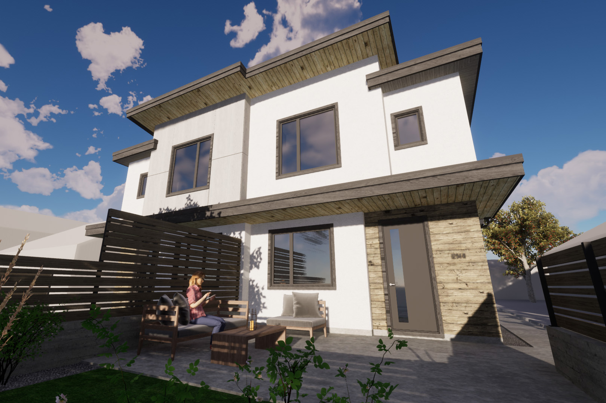

Are you a developer or RU7 owner looking for the answer to your investment property? Something unique that will stand out from the ever increasing repition occuring along the side streets of the downtown core as density increases? Our new fourplex design is the perfect solution!

Home Craft knows a thing or two about fourplexes, in fact, for the last six months it's been located in one! The work from home arrangement has given plenty of time to contemplate all the nuances and nuisances of fourplex living and come up with some clever solutions. 

Our contemporary design stands out from the crowd that's dominated by repetitive suburban style facades, or boxy modern attempts that rely excessive and seemingly arbitrary material changes for visual interest. The massing we've created supports natural transitions for a variety of finish options.

The design is modular, allowing for a variety of two and three bedroom layouts to be mixed within a single building to suit the lots setback and floor area ratio requirements. Optional roof top terraces, slab on grade, crawl spaces, or even full basements can be chosen depending on the budget and target demographic. Whether it's on a small RU7 lot or intended as a luxury downtown home we can tailor the design to suit your needs.

Get in touch for more information on how we can help you investment with this unique and desirable design!

